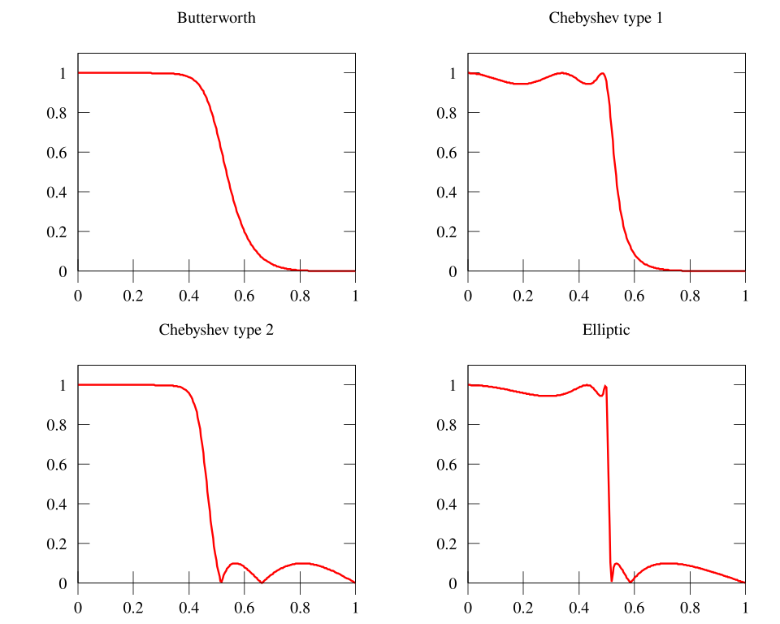

### 6. 切比雪夫 (Chebyshev) 低通滤波器设计：平衡通带波动与过渡带陡峭度 ⚖️

我们在学习巴特沃思滤波器时了解到，它以牺牲过渡带为代价换取了通带的最大平坦性。但在很多应用中，我们可能更希望获得更陡峭的过渡带，即使通带内存在一些微小的幅度波动（只要在允许范围内）。这时，**切比雪夫滤波器**就登场了。

#### 6.1 切比雪夫 I 型 (Chebyshev Type I) 逼近特性

切比雪夫 I 型滤波器允许在**通带内出现等幅度的波纹 (Equal Ripple)**，以此换取比同阶巴特沃思滤波器**更窄的过渡带**。其阻带特性仍然是单调下降的。

*   **幅度平方函数的定义**:
    切比雪夫 I 型低通滤波器的幅度平方响应由下式定义：
    $\boxed{ |H(j\Omega)|^2 = \frac{1}{1 + \epsilon^2 C_N^2(\Omega/\Omega_p)} }$
    这里：
    *   $N$: 滤波器的**阶数**。
    *   $\Omega_p$: **通带截止频率**。注意：对于切比雪夫 I 型，$\Omega_p$ 定义为**通带波纹的终点频率**，即幅度最后一次达到 $1/\sqrt{1+\epsilon^2}$ 的频率。
    *   $\epsilon$: **通带波纹系数**，它决定了通带内的波动范围。通带最大增益为 1，最小增益为 $1/\sqrt{1+\epsilon^2}$。通带最大衰减 $A_p$ (dB) 与 $\epsilon$ 的关系是 $A_p = 10\log_{10}(1+\epsilon^2)$。
    *   $C_N(x)$: **N 阶切比雪夫多项式 (Chebyshev Polynomial)**。这是切比雪夫滤波器的“灵魂”所在。

*   **切比雪夫 I 型滤波器的“个性签名”**:
    1.  **通带等波纹**: 在 $0 \le \Omega \le \Omega_p$ 范围内，幅度在 1 和 $1/\sqrt{1+\epsilon^2}$ 之间来回波动 $N$ 次（或 $N/2$ 个完整波纹周期）。
    2.  **阻带单调下降**: 在 $\Omega > \Omega_p$ 后，幅度响应单调递减。
    3.  **更陡峭的过渡带**: 相比同阶数的巴特沃思滤波器，切比雪夫滤波器的过渡带更窄，滚降更快。
    4.  **归一化频率 $\Omega/\Omega_p$**: 注意到公式中使用的是 $\Omega/\Omega_p$，这意味着通带边缘总是对应于切比雪夫多项式变量 $x=1$ 的位置。
    5.  **直流增益**:
        *   如果 $N$ 是奇数，$C_N(0)=0$，则 $|H(j0)|^2 = 1$ (直流增益为1)。
        *   如果 $N$ 是偶数，$C_N(0)=\pm 1$，则 $|H(j0)|^2 = 1/(1+\epsilon^2)$ (直流增益小于1，对应波纹的谷值)。
    6.  **固定点**: 无论 $N$ 为何值，所有切比雪夫 I 型滤波器的幅度响应曲线都会经过点 $(\Omega_p, 1/\sqrt{1+\epsilon^2})$。
    7.  **极值点数量**: 在 $0 \le \Omega \le \Omega_p$ 范围内，包括 $\Omega=0$ 和 $\Omega=\Omega_p$ 在内，共有 $N+1$ 个幅度极值点 (波峰或波谷)。
    *    (展示 N=5 和 N=6 时的特性差异)

#### 6.2 切比雪夫多项式 $C_N(x)$：波纹的制造者 〰️

切比雪夫多项式是定义切比雪夫滤波器特性的关键。

*   **定义**:
    $\boxed{ C_N(x) = \begin{cases} \cos(N \arccos x), & |x| \le 1 \\ \cosh(N \text{ arcosh } x), & |x| > 1 \end{cases} }$
    *   当 $|x| \le 1$ (对应滤波器的通带 $\Omega/\Omega_p \le 1$) 时，$C_N(x)$ 在 +1 和 -1 之间振荡，产生了等波纹特性。
    *   当 $|x| > 1$ (对应滤波器的阻带 $\Omega/\Omega_p > 1$) 时，$C_N(x)$ 的绝对值随 $x$ 单调快速增长，导致阻带幅度单调下降。

*   **递推关系 (非常实用)**:
    $\boxed{ C_{N+1}(x) = 2x C_N(x) - C_{N-1}(x) }$
    初始条件: $C_0(x) = 1$, $C_1(x) = x$。
    利用这个递推关系可以方便地得到任意阶的多项式：
    *   $C_2(x) = 2x C_1(x) - C_0(x) = 2x(x) - 1 = 2x^2 - 1$ (偶对称)
    *   $C_3(x) = 2x C_2(x) - C_1(x) = 2x(2x^2-1) - x = 4x^3 - 3x$ (奇对称)
    *   $C_4(x) = 2x C_3(x) - C_2(x) = 2x(4x^3-3x) - (2x^2-1) = 8x^4 - 8x^2 + 1$ (偶对称)
    *   ...
    *   **重要性质**: $C_N(x)$ 是 $N$ 阶多项式，其最高次项系数为 $2^{N-1}$ (对于 $N \ge 1$)。

*   **图形**:
     (展示 $C_N(x)$ 曲线)
    *   在 $[-1, 1]$ 区间内，曲线在 $\pm 1$ 之间波动。
    *   在 $|x|>1$ 区间外，曲线单调快速增长（或下降）。$N$ 越大，增长越快。

#### 6.3 按部就班：Chebyshev I 低通滤波器的设计步骤 (公式法)

假设给定模拟低通指标：$\Omega_p, A_p, \Omega_s, A_s$。

1.  **第一步：确定通带波纹系数 $\epsilon$** ✅
    *   根据通带最大衰减 $A_p$ (dB) 计算 $\epsilon$:
        $\boxed{ \epsilon = \sqrt{10^{0.1A_p} - 1} }$
        *根据通带最大衰减 $A_p$ (dB) 与 $\epsilon$ 的关系： $A_p = 10\log_{10}(1+\epsilon^2)$
    *   例如，如果 $A_p=3dB$, $\epsilon \approx 0.9976 \approx 1$。如果 $A_p=1dB$, $\epsilon \approx 0.5088$。如果 $A_p=0.2dB$, $\epsilon \approx 0.2171$。

2.  **第二步：确定滤波器的阶数 N** 🚩
    *   我们需要找到满足所有指标的最小整数阶数 $N$。
    *   主要利用阻带指标 $A_s$ 来确定 $N$。在阻带起始频率 $\Omega_s$ 处，要求 $|H(j\Omega_s)|^2 \le 10^{-0.1A_s}$。
    *   即 $1 + \epsilon^2 C_N^2(\Omega_s/\Omega_p) \ge 10^{0.1A_s}$。
    *   由于在阻带 $\Omega_s/\Omega_p > 1$，我们使用 $C_N(x) = \cosh(N \text{ arcosh } x)$ 的定义。
    *   $C_N^2(\Omega_s/\Omega_p) \ge (10^{0.1A_s} - 1)/\epsilon^2$
    *   $|\cosh(N \text{ arcosh}(\Omega_s/\Omega_p))| \ge \sqrt{10^{0.1A_s} - 1} / \epsilon$
    *   由于 $\cosh(y) > 0$ 对实数 $y$, 并且 $\text{arcosh}(x) > 0$ 对 $x>1$,
        $N \text{ arcosh}(\Omega_s/\Omega_p) \ge \text{arcosh}\left( \frac{\sqrt{10^{0.1A_s} - 1}}{\epsilon} \right)$
    *   最终得到计算 $N$ 的公式：
        $\boxed{ N \ge \frac{\text{arcosh}\left( \sqrt{(10^{0.1A_s} - 1) / (10^{0.1A_p} - 1)} \right)}{\text{arcosh}(\Omega_s/\Omega_p)} }$
        (其中 $\epsilon^2 = 10^{0.1A_p}-1$)
    *   **回顾**: $\text{arcosh}(y) = \ln(y + \sqrt{y^2 - 1})$ 对 $y \ge 1$。
    *   计算出的 $N$ 值**必须向上取整**为最小整数。

3.  **第三步：构建归一化切比雪夫低通原型 $H(p)$** 
    *   切比雪夫滤波器的设计通常基于归一化的原型，但这里的归一化是相对于**通带截止频率 $\Omega_p$** 的，即 $p = s/\Omega_p$。这与巴特沃思基于 $\Omega_c$ 归一化不同。归一化后的幅度平方函数为:
        $|H(p)|^2|_{p=j\lambda} = \frac{1}{1+\epsilon^2 C_N^2(\lambda)}$ (其中 $\lambda = \Omega/\Omega_p$)
    *   对应的 $H(p)H(-p)$ 表达式为: $H(p)H(-p) = \frac{1}{1+\epsilon^2 C_N^2(p/j)}$ (因为 $p=s/\Omega_p$, $s=j\Omega$, $\lambda=\Omega/\Omega_p$, 所以 $p=j\lambda$, $\lambda = p/j = -jp$)。
        $H(p)H(-p) = \frac{1}{1+\epsilon^2 C_N^2(-jp)}$
    *   **关键：寻找归一化极点 $p_k$**
        $H(p)H(-p)$ 的极点是方程 $1+\epsilon^2 C_N^2(-jp) = 0$ 的根。求解这个方程需要用到 $C_N(x) = \cos(N \arccos x)$ 并进行解析延拓。
        经过推导，在**左半平面 (LHP)** 内，可以得到 N 阶归一化切比雪夫低通滤波器的极点 $p_k = \sigma_k + j\omega_k$：
        $\boxed{ \sigma_k = -\sinh(\phi_2) \sin\left(\frac{(2k+1)\pi}{2N}\right) }$
        $\boxed{ \omega_k = \cosh(\phi_2) \cos\left(\frac{(2k+1)\pi}{2N}\right) }$
        for $k=0, 1, \dots, N-1$.
        其中 $\boxed{ \phi_2 = \frac{1}{N} \text{arsinh}(1/\epsilon) }$
        **回顾**: $\text{arsinh}(y) = \ln(y + \sqrt{y^2 + 1})$
        **回顾**: $\sinh(y) = (e^y - e^{-y})/2$, $\cosh(y) = (e^y + e^{-y})/2$

    *   **极点分布特点**:
        *   这些极点位于 $p$ 平面的**椭圆**上。
        *   椭圆的半长轴 (沿虚轴) 为 $b = \cosh(\phi_2)$，半短轴 (沿负实轴) 为 $a = \sinh(\phi_2)$。椭圆方程为 $(\sigma/a)^2 + (\omega/b)^2 = 1$。
        *   

    *   **归一化系统函数 $H(p)$**:
        切比雪夫 I 型也是全极点滤波器 (有限零点都在无穷远)。其归一化系统函数为：
        $$\boxed{ H(p) = \frac{K}{\prod_{k=0}^{N-1} (p - p_k)} }$$
        其中 $p_k$ 是上述计算出的 $N$ 个 LHP 极点。
        考虑到切比雪夫多项式首项系数的特点，推导可得：        $$\boxed{H(p) = \frac{1}{\epsilon 2^{N-1} \prod_{k=0}^{N-1} (p - p_k)}}$$

4.  **第四步：反归一化得到实际系统函数 $H_a(s)$** 
    *   将归一化变量 $p$ 替换回 $s/\Omega_p$:
        $\boxed{ H_a(s) = H(p)|_{p=s/\Omega_p} }$
        将 $p = s/\Omega_p$ 代入 $H(p)$ 的表达式即可。

#### 6.4 便捷之路：Chebyshev I 设计的查表/图法 📈📉

与巴特沃思类似，切比雪夫滤波器的设计也可以借助图表。

1.  **频率归一化 (以 $\Omega_p$ 为参考)**:
    *   $\lambda_s = \Omega_s / \Omega_p$。此时归一化通带截止频率 $\lambda_p=1$。

2.  **查阅归一化衰减特性图确定阶数 N**:
    *   需要使用**特定于切比雪夫滤波器和特定通带波纹 $A_p$** 的图表。例如，有 $A_p=0.2dB$ 的图， $A_p=1dB$ 的图， $A_p=3dB$ 的图等。
    *   在对应 $A_p$ 的图上，找到横坐标 $\lambda_s = \Omega_s/\Omega_p$，纵坐标要求衰减 $A_s$，选择能够覆盖该点的最低阶数 $N$ 的曲线。
    *   

3.  **查表确定归一化低通原型 $H(p)$ 的极点或分母多项式/因式**:
    *   一旦确定了 $N$ 和 $A_p$，就可以查阅对应的“归一化切比雪夫低通滤波器参数表”。这些表会给出归一化极点 $p_k$，或者直接给出分母多项式 $D(p) = \prod (p-p_k)$ 的系数或其因式分解形式。
    *   

4.  **反归一化得到 $H_a(s)$**:
    *   $H_a(s) = H(p)|_{p=s/\Omega_p}$。

*   **切比雪夫查表法的重要提示** ⚠️:
    *   切比雪夫滤波器的设计与**通带波纹 $A_p$ 紧密相关**。必须使用对应 $A_p$ 的图表来确定阶数 $N$ 和查找原型参数。
    *   与巴特沃思不同，这里的 $\Omega_p$ 通常**不是** -3dB 频率点 (除非 $A_p=3dB$)，而是通带波纹结束的频率点。
例题：

#### 6.5 借助现代工具：Matlab 实现 💻

#### 6.6 切比雪夫 I 型设计的反思：得与失

*   **优点**:
    *   在阶数 $N$ 相同的情况下，比巴特沃思滤波器具有**更窄的过渡带**和**更快的阻带滚降速率**。对于给定的指标，通常可以用比巴特沃思**更低的阶数**来实现。
*   **缺点**:
    *   **通带内存在波纹**: 这可能不适用于对幅度响应平坦度要求极高的场合。
    *   **相位特性比巴特沃思差**: 通带内的波纹导致相位响应的非线性更严重。
    *   **对元件值更敏感**: 实现时对元件参数变化的敏感度更高。

*   **设计总结图**: 

### 7. 椭圆 (Elliptic / Cauer) 滤波器：效率的极致追求 🚀

当我们希望在**阶数 $N$ 固定**的情况下，获得**最窄的过渡带**，或者说，对于给定的通带和阻带指标，使用**最低的阶数**来实现时，**椭圆滤波器**是最佳选择。

*   **核心特点**:
    *   在**通带**和**阻带**内都具有**等波纹 (Equal Ripple)** 特性。
    *   在所有相同阶数的滤波器中，具有**最陡峭的过渡带**。

*   **幅度平方函数的形态 (概念性)**:
    其幅度平方函数 $|H(j\Omega)|^2$ 的形式更为复杂，涉及到**雅可比椭圆函数 (Jacobi Elliptic Functions)**，通常表示为：
    $|H(j\Omega)|^2 = \frac{1}{1 + \epsilon^2 R_N^2(\Omega/\Omega_p)}$
    其中 $R_N(x)$ 是 N 阶**切比雪夫有理函数**，它由椭圆函数导出。

*   **特性**:
    *   通带 $0 \le \Omega \le \Omega_p$ 内，幅度在 1 和 $1/\sqrt{1+\epsilon^2}$ 之间波动。
    *   阻带 $\Omega \ge \Omega_s$ 内，幅度在 0 和某个最大值 $1/A$ 之间波动（$A_s = 20\log_{10}A$）。
    *   过渡带 ($\Omega_p < \Omega < \Omega_s$) 非常窄。

*   **设计**:
    椭圆滤波器的手动设计非常复杂，通常依赖于专门的表格或设计软件。

*   **Matlab 实现**:略

*   **优点**:
    *   **效率最高**: 对于给定的指标，阶数最低。
    *   **过渡带最窄**。
*   **缺点**:
    *   **通带和阻带都有波纹**。
    *   **相位特性最差**: 非线性最严重。
    *   **设计复杂** (手动)。
    *   **对元件值最敏感**。

### 8. 三种模拟滤波器的特性比较 🆚

让我们总结一下巴特沃思 (B)、切比雪夫 I 型 (C) 和椭圆 (E) 这三种常用低通滤波器的关键特性差异：

| 特性          | 巴特沃思 (Butterworth) | 切比雪夫 I (Chebyshev I) | 椭圆 (Elliptic/Cauer) |
| :---------- | :----------------- | :------------------- | :------------------ |
| **通带特性**    | 最大平坦 (单调)          | 等波纹                  | 等波纹                 |
| **阻带特性**    | 单调下降               | 单调下降                 | 等波纹                 |
| **过渡带宽度**   | 最宽                 | 中等                   | 最窄 (最陡峭)            |
| **相同指标阶数N** | 最高                 | 中等                   | 最低                  |
| **相位特性**    | 最好                 | 中等                   | 最差 (非线性最严重)         |
| **设计复杂度**   | 最简单                | 中等                   | 最复杂 (手动)            |
| **参数敏感性**   | 最低                 | 中等                   | 最高                  |
| **零点位置**    | 全在无穷远              | 全在无穷远                | 有限 (虚轴上)            |

*   

**如何选择？**
选择哪种滤波器取决于具体的应用需求：
*   如果对通带平坦度和相位线性度要求高，且可以接受较宽的过渡带或较高的阶数，选择 **巴特沃思**。
*   如果需要较窄的过渡带，可以容忍通带波纹，选择 **切比雪夫 I 型**。
*   如果对过渡带要求极高，或者希望阶数尽可能低，且可以接受通带和阻带的波纹以及较差的相位特性，选择 **椭圆滤波器**。

### 9. 模拟滤波器的频率变换：从低通到万能 🪄

我们已经掌握了如何设计模拟**低通**滤波器（LPF）的原型。但实际应用中我们还需要高通 (HPF)、带通 (BPF)、带阻 (BSF) 滤波器。**频率变换**技术允许我们利用设计好的低通原型 $H_{LP}(p)$（通常是归一化的，截止频率为1 rad/s）通过简单的变量替换得到其他类型的滤波器 $H_d(s)$。

*   **基本思想**:
    找到一个从归一化复频率 $p$ 到实际复频率 $s$ 的映射关系 $p = q(s)$，使得：
    1.  **频率轴映射正确**: $H_{LP}(p)$ 在 $p$ 平面虚轴 $p=j\lambda$ 上的特性 (通带、阻带) 被正确地映射到目标滤波器 $H_d(s)$ 在 $s$ 平面虚轴 $s=j\Omega$ 上所需的特性。
    2.  **稳定性保持**: $p$ 平面的左半平面 (LHP) 必须映射到 $s$ 平面的左半平面 (LHP)，以保证变换后的滤波器 $H_d(s)$ 仍然是稳定的。
    这个映射函数 $q(s)$ 通常是 $s$ 的有理函数。
    $\boxed{ H_d(s) = H_{LP}(p)|_{p=q(s)} }$

*   **关键参数定义**:
    *   $H_{LP}(p)$: 归一化低通原型，通常 $\lambda_p=1$ (对应 $p=j1$)。
    *   $H_d(s)$: 目标滤波器 (LPF', HPF, BPF, BSF)。
    *   $\Omega_p', \Omega_s'$: 目标 LPF' 或 HPF 的通/阻带边缘频率。
    *   $\Omega_{p1}, \Omega_{p2}, \Omega_{s1}, \Omega_{s2}$: 目标 BPF 或 BSF 的通/阻带边缘频率。
    *   $\Omega_0 = \sqrt{\Omega_{p1}\Omega_{p2}}$: BPF/BSF 的几何中心频率 (假设对称)。
    *   $B = \Omega_{p2} - \Omega_{p1}$: BPF/BSF 的 (通带) 带宽 (假设对称)。
    *   $\lambda_s$: 设计原型 LPF 所需的**归一化阻带起始频率**，由目标滤波器的指标计算得到。

*   **频率变换公式表**:

| 目标滤波器类型         | 归一化 LPF 指标 $\lambda_s$                                       | 频率变换 $p=q(s)$                         |
| :------------------- | :---------------------------------------------------------------- | :---------------------------------------- |
| **低通 $\to$ 新低通**  | $\lambda_s = \Omega_s' / \Omega_p'$                               | $p = s / \Omega_p'$                       |
| **低通 $\to$ 高通**    | $\lambda_s = \Omega_p' / \Omega_s'$                               | $p = \Omega_p' / s$                       |
| **低通 $\to$ 带通**    | $\lambda_s = \frac{\Omega_{s2}-\Omega_{s1}}{\Omega_{p2}-\Omega_{p1}}$ | $p = \frac{s^2 + \Omega_0^2}{B s}$        |
| **低通 $\to$ 带阻**    | $\lambda_s = \frac{\Omega_{p2}-\Omega_{p1}}{\Omega_{s2}-\Omega_{s1}}$ | $p = \frac{B s}{s^2 + \Omega_0^2}$        |
    **注**: BPF 和 BSF 的 $\lambda_s$ 公式假设目标滤波器具有几何对称性 ($\Omega_0^2 = \Omega_{p1}\Omega_{p2} = \Omega_{s1}\Omega_{s2}$)。$B$ 通常指通带带宽 ($\Omega_{p2}-\Omega_{p1}$)。

*   **图形示意**:
    *   LP $\to$ LP': 只是频率轴的线性伸缩。
    *   LP $\to$ HP/BP/BS: 涉及更复杂的非线性频率轴映射。
        

#### 9.1 处理非几何对称的带通/带阻滤波器 📐

标准的频率变换公式是为**几何对称**的 BPF/BSF 设计的，即 $\Omega_0^2 = \Omega_{p1}\Omega_{p2} = \Omega_{s1}\Omega_{s2}$。如果给定的技术指标**不满足**这个条件，我们**不能直接**套用公式。

*   **解决方案**: **调整指标以满足对称性**。
    在满足原始衰减要求的前提下，修改一对带边频率（通常是调整阻带边沿用于 BPF 设计，调整通带边沿用于 BSF 设计），使其满足几何对称条件。

*   **非对称 BPF 设计步骤 (调整阻带)**:
    1.  计算通带几何中心频率 $\Omega_0^2 = \Omega_{p1}\Omega_{p2}$。
    2.  检查阻带是否对称: $\Omega_{s1}\Omega_{s2} \stackrel{?}{=} \Omega_0^2$。
    3.  如果不对称，需要调整 $\Omega_{s1}$ 或 $\Omega_{s2}$ 中的一个。通常以 $\Omega_0$ 为基准。
        *   计算假想的 $\bar{\Omega}_{s1} = \Omega_0^2 / \Omega_{s2}$。
        *   计算假想的 $\bar{\Omega}_{s2} = \Omega_0^2 / \Omega_{s1}$。
    4.  **选择调整方案**: 哪个调整后的阻带 $(\bar{\Omega}_{s1}, \Omega_{s2})$ 或 $(\Omega_{s1}, \bar{\Omega}_{s2})$ 能够**覆盖**原始的阻带衰减要求？通常意味着选择调整后**阻带宽度更窄**的方案，即调整后 $\bar{\Omega}_{s2}-\bar{\Omega}_{s1}$ 更小。
        *   **核心原则**: 调整后的阻带必须包含原始指标要求的频率范围，且满足几何对称。
    5.  确定最终的阻带衰减要求 $A_s = \max(A_{s1\_orig}, A_{s2\_orig})$ (如果两边衰减要求不同)。
    6.  使用调整后的对称指标 ($\Omega_{p1}, \Omega_{p2}, \bar{\Omega}_{s1}, \bar{\Omega}_{s2}, A_p, A_s$) 计算原型 LPF 的 $\lambda_s = (\bar{\Omega}_{s2}-\bar{\Omega}_{s1})/(\Omega_{p2}-\Omega_{p1})$。
    7.  进行后续设计。
    *   

*   **非对称 BSF 设计步骤 (调整通带)**:
    1.  计算阻带几何中心频率 $\Omega_0^2 = \Omega_{s1}\Omega_{s2}$。
    2.  检查通带是否对称: $\Omega_{p1}\Omega_{p2} \stackrel{?}{=} \Omega_0^2$。
    3.  如果不对称，以 $\Omega_0$ 为基准调整 $\Omega_{p1}$ 或 $\Omega_{p2}$。
        *   计算 $\bar{\Omega}_{p1} = \Omega_0^2 / \Omega_{p2}$。
        *   计算 $\bar{\Omega}_{p2} = \Omega_0^2 / \Omega_{p1}$。
    4.  **选择调整方案**: 选择调整后**通带宽度更窄**的方案，以确保满足原始的通带波纹 $A_p$ 要求。
    5.  确定最终的通带波纹要求 $A_p = \min(A_{p1\_orig}, A_{p2\_orig})$ (如果两边波纹要求不同)。
    6.  使用调整后的对称指标 ($\bar{\Omega}_{p1}, \bar{\Omega}_{p2}, \Omega_{s1}, \Omega_{s2}, A_p, A_s$) 计算原型 LPF 的 $\lambda_s = (\bar{\Omega}_{p2}-\bar{\Omega}_{p1})/(\Omega_{s2}-\Omega_{s1})$。
    7.  进行后续设计。
    *   

#### 9.2 模拟滤波器设计流程总结 (使用频率变换) 🗺️

1.  **确定目标滤波器的技术要求**: 类型 (LP/HP/BP/BS), 边缘频率 ($\Omega_p', \Omega_s'$, or $\Omega_{p1}, \Omega_{p2}, \Omega_{s1}, \Omega_{s2}$), 衰减指标 ($A_p, A_s$)。
2.  **(仅对 BPF/BSF)** 检查几何对称性。如果不对称，按照 9.1 节的方法调整边缘频率，使其满足几何对称，并确定最终的 $A_p$ 和 $A_s$。
3.  **计算归一化低通原型 LPF 的指标**:
    *   通带边缘 $\lambda_p = 1$。
    *   通带衰减 $A_p$ (使用调整后的，如果适用)。
    *   阻带衰减 $A_s$ (使用调整后的，如果适用)。
    *   根据 **频率变换表 (9节)** 计算归一化阻带起始频率 $\lambda_s$。
4.  **设计归一化低通原型 $H_{LP}(p)$**:
    *   选择逼近方法 (Butterworth, Chebyshev, Elliptic)。
    *   根据 $\lambda_s, A_p, A_s$ 确定 LPF 阶数 $N$ (向上取整)。
    *   (如果需要) 计算 $\epsilon$ 或 $\Omega_c$。
    *   计算或查表得到归一化 LPF 的极点 $p_k$ (和零点 $z_k$ 如果是 Elliptic)。
    *   构建 $H_{LP}(p) = K \frac{\prod(p-z_k)}{\prod(p-p_k)}$。
5.  **执行频率变换**:
    *   根据 **频率变换表 (9节)** 找到对应的变换公式 $p=q(s)$。
    *   将此 $p=q(s)$ 代入 $H_{LP}(p)$ 的表达式中。
    *   $\boxed{ H_d(s) = H_{LP}(p)|_{p=q(s)} }$
6.  **化简得到最终的 $H_d(s)$**: 展开并整理代换后的表达式，得到目标滤波器的系统函数 $H_d(s)$ (通常是 $s$ 的有理分式)。

#### 9.3 频率变换示例 💡

*   **例1: 设计巴特沃思带阻滤波器 (BSF)** 
  

*   **例2: 设计带通滤波器 (BPF)** 
    
    
#### 9.4 借助现代工具：Matlab 实现频率变换 💻

Matlab 提供了直接进行频率变换的函数，无需手动代入：

*   `[bt, at] = lp2lp(b, a, Wo)`: 低通到低通 (Wo 是目标 LPF 截止频率 $\Omega_p'$)。
*   `[bt, at] = lp2hp(b, a, Wo)`: 低通到高通 (Wo 是目标 HPF 截止频率 $\Omega_p'$)。
*   `[bt, at] = lp2bp(b, a, Wo, Bw)`: 低通到带通 (Wo 是中心频率 $\Omega_0$, Bw 是带宽 $B$)。
*   `[bt, at] = lp2bs(b, a, Wo, Bw)`: 低通到带阻 (Wo 是中心频率 $\Omega_0$, Bw 是带宽 $B$)。
    *   输入 `b, a` 是归一化 LPF ($\lambda_p=1$) 的分子分母系数 (按 $p$ 的降幂排列)。
    *   输出 `bt, at` 是目标滤波器 $H_d(s)$ 的分子分母系数 (按 $s$ 的降幂排列)。

**使用流程**:
1.  根据目标指标和类型，计算原型 LPF 的 $\lambda_s, A_p, A_s$。
2.  设计归一化 LPF $H_{LP}(p)$ (例如使用 `butter` 或 `cheby1` 配合 `Wn=1`) 得到系数 `b, a`。
3.  计算目标滤波器的中心频率 `Wo` 和带宽 `Bw` (如果需要)。
4.  调用相应的 `lp2xx` 函数进行变换，得到目标滤波器的系数 `bt, at`。

---

**本章小结与展望**:
我们已经系统学习了如何设计模拟低通滤波器（巴特沃思、切比雪夫、椭圆）以及如何通过频率变换将低通原型转换为其他类型的模拟滤波器。这是实现 IIR 数字滤波器设计“模拟原型法”的关键第一步。

**接下来**，我们将学习如何将这些设计好的模拟滤波器 $H_a(s)$ **转换**为我们最终需要的**数字滤波器 $H(z)$**。两种最重要的方法是**冲激响应不变法**和**双线性变换法**。这将是我们下一部分笔记的重点。🚀